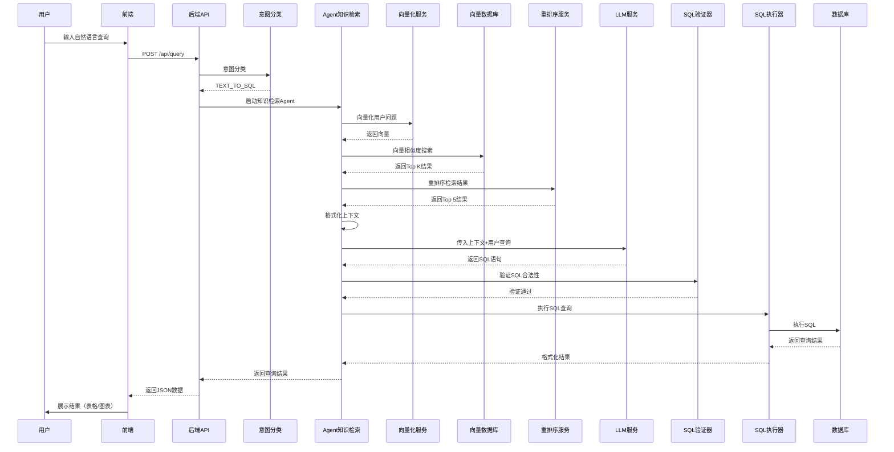
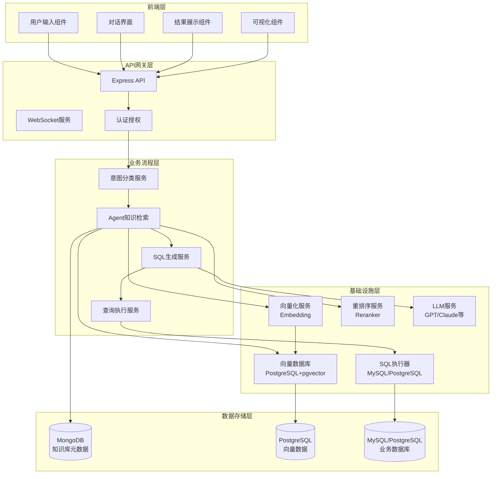

# 问数业务流程架构思维导图（NL2SQL / Text2SQL）

**版本**：1.0  
**日期**：2025-01-23  
**目标**：自然语言查询数据（NL2SQL，Text2SQL）

---

## 一、整体架构概览

```
┌─────────────────────────────────────────────────────────────────┐
│                        前端层（Frontend）                        │
│  ┌──────────────┐  ┌──────────────┐  ┌──────────────┐        │
│  │  用户输入    │  │  对话界面    │  │  结果展示    │        │
│  │  自然语言    │  │  历史管理    │  │  表格/图表  │        │
│  └──────┬───────┘  └──────┬───────┘  └──────┬───────┘        │
└─────────┼─────────────────┼─────────────────┼──────────────────┘
          │                 │                 │
          │  HTTP/WebSocket │                 │
          │                 │                 │
┌─────────▼─────────────────▼─────────────────▼──────────────────┐
│                     后端层（Backend）                             │
│  ┌──────────────────────────────────────────────────────────┐  │
│  │              业务流程层（产品架构）                        │  │
│  │  ┌──────────┐  ┌──────────┐  ┌──────────┐              │  │
│  │  │意图理解  │→ │知识检索  │→ │SQL生成   │              │  │
│  │  │分类      │  │Agent     │  │执行      │              │  │
│  │  └──────────┘  └──────────┘  └──────────┘              │  │
│  └──────────────────────────────────────────────────────────┘  │
│  ┌──────────────────────────────────────────────────────────┐  │
│  │              基础设施层（技术架构）                        │  │
│  │  ┌──────────┐  ┌──────────┐  ┌──────────┐              │  │
│  │  │向量化    │  │向量存储  │  │LLM服务   │              │  │
│  │  │服务      │  │数据库    │  │SQL执行   │              │  │
│  │  └──────────┘  └──────────┘  └──────────┘              │  │
│  └──────────────────────────────────────────────────────────┘  │
└─────────────────────────────────────────────────────────────────┘
```

---

## 二、前端架构设计

### 2.1 用户交互层

#### 输入组件
- ✅ **自然语言输入框**：支持多行文本输入
- ✅ **语音输入**：可选语音转文字功能
- ✅ **历史查询建议**：智能提示历史查询
- ✅ **查询模板**：常用查询模板快速选择

#### 对话界面
- ✅ **多轮对话管理**：保持上下文连贯性
- ✅ **对话历史展示**：可查看和回溯历史对话
- ✅ **思维链可视化**：展示Agent推理过程
- ✅ **实时状态反馈**：查询处理状态提示

#### 结果展示
- ✅ **表格展示**：结构化数据表格
- ✅ **图表可视化**：自动生成图表（柱状图、折线图、饼图等）
- ✅ **数据导出**：支持CSV、Excel导出
- ✅ **SQL预览**：展示生成的SQL语句
- ✅ **执行计划**：展示SQL执行计划（可选）

### 2.2 前端技术栈

```
前端架构
├── UI框架
│   ├── React 18+
│   ├── TypeScript
│   └── Ant Design / Material-UI
├── 状态管理
│   ├── Redux / Zustand
│   └── React Query (数据缓存)
├── 通信层
│   ├── HTTP Client (Axios)
│   ├── WebSocket (实时通信)
│   └── SSE (Server-Sent Events)
└── 可视化
    ├── ECharts / Chart.js
    ├── D3.js (高级可视化)
    └── React Flow (思维链可视化)
```

### 2.3 前端核心功能模块

#### 查询管理模块
- **查询构建器**：可视化SQL构建（可选）
- **查询历史**：本地存储 + 服务端同步
- **查询收藏**：收藏常用查询
- **查询分享**：分享查询给其他用户

#### 数据展示模块
- **表格组件**：支持排序、筛选、分页
- **图表组件**：自动识别数据类型生成图表
- **数据对比**：多查询结果对比
- **数据钻取**：从汇总数据钻取到明细

#### 用户设置模块
- **偏好设置**：默认图表类型、表格样式等
- **主题切换**：明暗主题切换
- **快捷键配置**：自定义快捷键

---

## 三、后端架构设计

## 3.1 业务流程层（产品架构）

### 核心业务流程

```
用户输入
  ↓
意图理解分类
  ↓
Agent知识检索
  ├── 用户问题向量化
  ├── 检索向量知识库
  └── 重排优化整理出格式化的上下文
  ↓
将整理后的context传入LLM
  ↓
生成SQL查询语句
  ↓
解析合法性
  ↓
执行查询
  ↓
返回结果
```

### 3.1.1 用户输入处理

**功能**：接收并预处理用户自然语言查询

**输入**：
- 自然语言查询文本
- 用户ID
- 会话ID（用于多轮对话）
- 查询上下文（历史对话）

**处理逻辑**：
```javascript
// 伪代码示例
async function processUserInput(userQuery, userId, sessionId) {
  // 1. 文本清理
  const cleanedQuery = sanitizeInput(userQuery);
  
  // 2. 提取关键信息
  const keywords = extractKeywords(cleanedQuery);
  
  // 3. 检测查询类型
  const queryType = detectQueryType(cleanedQuery);
  
  // 4. 构建查询对象
  return {
    originalQuery: userQuery,
    cleanedQuery,
    keywords,
    queryType,
    userId,
    sessionId,
    timestamp: new Date()
  };
}
```

**输出**：
- 清理后的查询文本
- 提取的关键词
- 查询类型标识

---

### 3.1.2 意图理解分类

**功能**：识别用户查询意图，分类为不同处理路径

**意图分类**：
- ✅ **TEXT_TO_SQL**：需要生成SQL的查询
- ✅ **GENERAL**：一般性问题（知识问答）
- ✅ **MISLEADING_QUERY**：误导性查询（无法回答）
- ✅ **DATA_EXPLORATION**：数据探索性查询
- ✅ **REPORT_GENERATION**：报表生成请求

**实现方式**：

#### 方式一：规则分类（DefaultAskdataAgent）
```javascript
// 基于规则的意图分类
function classifyIntent(query) {
  const sqlKeywords = ['查询', '统计', '汇总', '计算', '筛选'];
  const generalKeywords = ['是什么', '如何', '为什么'];
  
  if (sqlKeywords.some(kw => query.includes(kw))) {
    return 'TEXT_TO_SQL';
  }
  if (generalKeywords.some(kw => query.includes(kw))) {
    return 'GENERAL';
  }
  return 'TEXT_TO_SQL'; // 默认
}
```

#### 方式二：LLM分类（AgenticAskdataAgent）
```javascript
// 使用LLM进行意图分类
async function classifyIntentWithLLM(query) {
  const prompt = `
    分析以下用户查询的意图，返回分类结果：
    查询：${query}
    
    分类选项：
    1. TEXT_TO_SQL - 需要查询数据库
    2. GENERAL - 一般性问题
    3. MISLEADING_QUERY - 无法回答的问题
    
    返回JSON格式：{"intent": "...", "confidence": 0.95}
  `;
  
  const result = await llmService.call(prompt);
  return JSON.parse(result);
}
```

**输出**：
- 意图分类结果
- 置信度分数
- 分类依据

---

### 3.1.3 Agent知识检索

**功能**：通过向量检索从知识库中获取相关上下文信息

#### 步骤1：用户问题向量化

**功能**：将用户自然语言问题转换为向量表示

**实现**：
```javascript
// 使用Embedding服务将问题向量化
async function vectorizeQuery(query) {
  const embeddingService = new EmbeddingService();
  
  // 调用向量化服务（BGE模型或其他）
  const embedding = await embeddingService.embed(query);
  
  return {
    query,
    embedding, // 384维向量
    dimension: 384
  };
}
```

**技术选型**：
- ✅ **BGE Small**：384维，本地ONNX模型
- ✅ **OpenAI Text Embedding**：1536维，云端API
- ✅ **Azure OpenAI Embedding**：企业级云端服务
- ✅ **自定义Embedding服务**：通过RAG API调用

#### 步骤2：检索向量知识库

**功能**：在向量数据库中搜索相似的知识条目

**知识库类型**：
- ✅ **语义模型（semantic_model）**：数据库表结构、字段说明
- ✅ **QA对（qa_pair）**：常见问题答案对
- ✅ **同义词（synonym）**：业务术语同义词映射
- ✅ **业务知识（business_knowledge）**：业务规则、流程说明
- ✅ **文件（file）**：文档、手册等

**检索实现**：
```javascript
// 向量相似度搜索
async function searchKnowledgeBase(queryEmbedding, userId, topK = 10) {
  const vectorDBService = new VectorDBService();
  
  // 在PostgreSQL + pgvector中搜索
  const results = await vectorDBService.searchSimilar({
    queryEmbedding,
    userId,
    types: ['semantic_model', 'qa_pair', 'synonym', 'business_knowledge'],
    topK,
    similarityThreshold: 0.5 // 相似度阈值
  });
  
  return results.map(r => ({
    knowledgeEntryId: r.knowledgeEntryId,
    content: r.content,
    metadata: r.metadata,
    similarity: r.similarity,
    type: r.type
  }));
}
```

**检索策略**：
- **混合检索**：向量检索 + 关键词检索
- **多类型检索**：同时检索多种知识类型
- **用户隔离**：只检索当前用户的知识库
- **项目隔离**：支持项目级知识库隔离

#### 步骤3：重排优化整理出格式化的上下文

**功能**：对检索结果进行重排序和格式化，生成LLM可用的上下文

**重排序实现**：
```javascript
// 使用Reranker对检索结果重排序
async function rerankAndFormat(results, query) {
  const rerankerService = new RerankerService();
  
  // 1. 重排序（使用ONNX模型或云端API）
  const rerankedResults = await rerankerService.rerank({
    query,
    documents: results.map(r => r.content),
    topK: 5 // 只保留Top 5
  });
  
  // 2. 格式化上下文
  const formattedContext = formatContext(rerankedResults);
  
  return formattedContext;
}

// 格式化上下文
function formatContext(results) {
  const sections = {
    semanticModels: [],
    qaPairs: [],
    synonyms: [],
    businessKnowledge: []
  };
  
  results.forEach(result => {
    switch (result.type) {
      case 'semantic_model':
        sections.semanticModels.push({
          database: result.metadata.database_name,
          table: result.metadata.table_name,
          schema: JSON.parse(result.content)
        });
        break;
      case 'qa_pair':
        sections.qaPairs.push({
          question: result.metadata.question,
          answer: result.metadata.answer
        });
        break;
      case 'synonym':
        sections.synonyms.push({
          noun: result.metadata.noun,
          synonyms: result.metadata.synonyms
        });
        break;
      case 'business_knowledge':
        sections.businessKnowledge.push(result.content);
        break;
    }
  });
  
  // 生成格式化的上下文字符串
  return formatContextString(sections);
}
```

**重排序技术**：
- ✅ **MS Marco MiniLM**：本地ONNX模型
- ✅ **Jina Reranker**：云端API
- ✅ **Cohere Reranker**：云端API
- ✅ **Infinity Reranker**：本地服务

**上下文格式**：
```
### SEMANTIC MODELS ###
数据库：mall_demo
表：orders
字段：
- order_id (int): 订单ID
- user_id (int): 用户ID
- amount (decimal): 订单金额
...

### QA PAIRS ###
Q: 如何查询订单总数？
A: 使用 COUNT(*) 函数统计订单表

### SYNONYMS ###
订单 → 订购, 下单, 购买

### BUSINESS KNOWLEDGE ###
订单处理流程包括：1. 接收订单 2. 验证库存 3. 处理支付 4. 发货
```

**输出**：
- 格式化的上下文字符串
- 检索到的知识条目列表
- 相似度分数

---

### 3.1.4 将整理后的context传入LLM

**功能**：构建LLM提示词，传入上下文和用户查询

**提示词构建**：
```javascript
// 构建Text2SQL提示词
async function buildPrompt(userQuery, context, queryHistory) {
  const promptTemplate = await loadPromptTemplate('text_to_sql_user_prompt');
  
  // 使用Jinja2模板引擎
  const prompt = renderTemplate(promptTemplate, {
    query: userQuery,
    semantic_models: context.semanticModels,
    qa_pairs: context.qaPairs,
    synonyms: context.synonyms,
    business_knowledge: context.businessKnowledge,
    query_time: new Date().toISOString(),
    histories: queryHistory,
    text_to_sql_rules: await getSQLRules(),
    sql_samples: await getSQLSamples(),
    data_samples: await getDataSamples()
  });
  
  return prompt;
}
```

**提示词结构**：
```
### GENERAL RULES ###
1. 遵循用户指令
2. 参考SQL示例

### SQL RULES ###
- 只使用SELECT语句
- 必须使用JOIN连接多表
- 使用lower()进行大小写不敏感比较
...

### SEMANTIC MODELS ###
[格式化的数据库结构信息]

### QA PAIRS ###
[相关问答对]

### SYNONYMS ###
[同义词映射]

### BUSINESS KNOWLEDGE ###
[业务知识文档]

### QUESTION ###
当前时间：2025-01-23T10:00:00Z
用户问题：查询最近一个月的订单总数

### FINAL ANSWER FORMAT ###
返回ANSI SQL查询语句
```

**LLM调用**：
```javascript
// 调用LLM生成SQL
async function callLLMForSQL(prompt) {
  const llmService = new LLMService();
  
  const response = await llmService.generate({
    messages: [
      { role: 'system', content: 'You are a SQL expert...' },
      { role: 'user', content: prompt }
    ],
    temperature: 0.1, // 低温度保证稳定性
    max_tokens: 1000
  });
  
  return response.content;
}
```

**LLM服务选择**：
- ✅ **OpenAI GPT-4 / GPT-3.5**：高质量SQL生成
- ✅ **Azure OpenAI**：企业级服务
- ✅ **本地LLM**：Ollama、Xinference
- ✅ **其他云端LLM**：DeepSeek、Anthropic Claude

---

### 3.1.5 生成SQL查询语句

**功能**：从LLM响应中提取SQL语句

**SQL提取**：
```javascript
// 从LLM响应中提取SQL
function extractSQL(llmResponse) {
  // 方式1：直接返回SQL
  if (isValidSQL(llmResponse.trim())) {
    return llmResponse.trim();
  }
  
  // 方式2：从代码块中提取
  const codeBlockMatch = llmResponse.match(/```sql\n([\s\S]*?)\n```/);
  if (codeBlockMatch) {
    return codeBlockMatch[1].trim();
  }
  
  // 方式3：从标记中提取
  const sqlMatch = llmResponse.match(/SQL:\s*([\s\S]*?)(?:\n\n|$)/);
  if (sqlMatch) {
    return sqlMatch[1].trim();
  }
  
  throw new Error('无法从LLM响应中提取SQL');
}
```

**SQL后处理**：
```javascript
// SQL后处理
function postProcessSQL(sql) {
  // 1. 移除注释
  sql = sql.replace(/--.*$/gm, '');
  sql = sql.replace(/\/\*[\s\S]*?\*\//g, '');
  
  // 2. 标准化格式
  sql = sql.trim();
  
  // 3. 验证基本语法
  if (!sql.match(/^SELECT/i)) {
    throw new Error('只支持SELECT语句');
  }
  
  return sql;
}
```

**输出**：
- 生成的SQL语句
- SQL类型（SELECT、聚合、JOIN等）
- 涉及的数据库和表

---

### 3.1.6 解析合法性

**功能**：验证SQL语句的合法性和安全性

**合法性检查**：

#### 语法检查
```javascript
// SQL语法检查
async function validateSQLSyntax(sql, databaseType) {
  const sqlParser = new SQLParser(databaseType);
  
  try {
    const ast = sqlParser.parse(sql);
    return {
      valid: true,
      ast,
      warnings: []
    };
  } catch (error) {
    return {
      valid: false,
      error: error.message,
      suggestions: []
    };
  }
}
```

#### 安全性检查
```javascript
// SQL安全性检查
function validateSQLSecurity(sql) {
  const securityChecks = {
    // 1. 禁止危险操作
    dangerousKeywords: ['DROP', 'DELETE', 'UPDATE', 'INSERT', 'ALTER', 'TRUNCATE'],
    // 2. 禁止系统函数
    dangerousFunctions: ['LOAD_FILE', 'INTO OUTFILE', 'INTO DUMPFILE'],
    // 3. 检查注入风险
    injectionPatterns: [/;\s*DROP/i, /;\s*DELETE/i, /UNION.*SELECT/i]
  };
  
  const issues = [];
  
  // 检查危险关键词
  securityChecks.dangerousKeywords.forEach(keyword => {
    if (sql.toUpperCase().includes(keyword)) {
      issues.push(`禁止使用 ${keyword} 操作`);
    }
  });
  
  // 检查注入模式
  securityChecks.injectionPatterns.forEach(pattern => {
    if (pattern.test(sql)) {
      issues.push('检测到潜在的SQL注入风险');
    }
  });
  
  return {
    safe: issues.length === 0,
    issues
  };
}
```

#### 语义检查
```javascript
// 语义检查：验证表名、字段名是否存在
async function validateSQLSemantics(sql, databaseSchema) {
  const tableNames = extractTableNames(sql);
  const columnNames = extractColumnNames(sql);
  
  const issues = [];
  
  // 检查表是否存在
  tableNames.forEach(table => {
    if (!databaseSchema.tables.find(t => t.name === table)) {
      issues.push(`表 ${table} 不存在`);
    }
  });
  
  // 检查字段是否存在
  columnNames.forEach(({ table, column }) => {
    const tableSchema = databaseSchema.tables.find(t => t.name === table);
    if (tableSchema && !tableSchema.columns.find(c => c.name === column)) {
      issues.push(`字段 ${table}.${column} 不存在`);
    }
  });
  
  return {
    valid: issues.length === 0,
    issues
  };
}
```

**检查结果**：
- ✅ **通过**：SQL合法且安全，可以执行
- ❌ **失败**：返回错误信息和修复建议

---

### 3.1.7 执行查询

**功能**：在数据库中执行SQL查询并返回结果

**执行流程**：
```javascript
// 执行SQL查询
async function executeSQL(sql, databaseConfig, userId) {
  const sqlExecutor = new SQLExecutor(databaseConfig);
  
  try {
    // 1. 权限检查
    await checkUserPermission(userId, databaseConfig);
    
    // 2. 执行查询
    const startTime = Date.now();
    const result = await sqlExecutor.execute(sql);
    const executionTime = Date.now() - startTime;
    
    // 3. 结果处理
    const processedResult = {
      columns: result.columns,
      rows: result.rows,
      rowCount: result.rows.length,
      executionTime,
      sql: sql,
      timestamp: new Date()
    };
    
    // 4. 记录查询历史
    await saveQueryHistory({
      userId,
      query: sql,
      result: processedResult
    });
    
    return processedResult;
  } catch (error) {
    // 错误处理
    return {
      error: error.message,
      sql: sql,
      suggestions: generateErrorSuggestions(error)
    };
  }
}
```

**结果格式化**：
```javascript
// 格式化查询结果
function formatQueryResult(result) {
  return {
    // 表格数据
    table: {
      columns: result.columns,
      data: result.rows
    },
    // 元数据
    metadata: {
      rowCount: result.rowCount,
      executionTime: result.executionTime,
      timestamp: result.timestamp
    },
    // SQL信息
    sql: {
      statement: result.sql,
      formatted: formatSQL(result.sql)
    },
    // 可视化建议
    visualization: suggestVisualization(result)
  };
}
```

**可视化建议**：
```javascript
// 根据数据特征建议可视化类型
function suggestVisualization(result) {
  const { columns, rows } = result;
  
  // 如果只有两列，可能是图表数据
  if (columns.length === 2) {
    const [xCol, yCol] = columns;
    if (isNumeric(yCol)) {
      return {
        type: 'line', // 或 bar, pie
        xAxis: xCol,
        yAxis: yCol
      };
    }
  }
  
  // 如果有多列，建议表格
  return {
    type: 'table'
  };
}
```

**输出**：
- 查询结果（表格数据）
- 执行元数据（行数、执行时间等）
- SQL语句
- 可视化建议

---

## 3.2 基础设施层（技术架构）

### 3.2.1 向量化服务（Embedding Service）

**功能**：将文本转换为向量表示

**技术实现**：
```javascript
class EmbeddingService {
  constructor() {
    this.provider = process.env.EMBEDDING_PROVIDER || 'bge';
    this.models = {
      bge: new BGEEmbeddingModel(), // 本地ONNX
      openai: new OpenAIEmbedding(), // 云端API
      azure: new AzureEmbedding()    // Azure服务
    };
  }
  
  async embed(text) {
    const model = this.models[this.provider];
    return await model.embed(text);
  }
  
  async embedBatch(texts) {
    // 批量向量化
    return await Promise.all(texts.map(t => this.embed(t)));
  }
}
```

**支持的模型**：
- ✅ **BGE Small**：384维，本地ONNX模型
- ✅ **BGE Large**：1024维，本地ONNX模型
- ✅ **OpenAI text-embedding-ada-002**：1536维
- ✅ **OpenAI text-embedding-3-small**：1536维
- ✅ **OpenAI text-embedding-3-large**：3072维

**性能优化**：
- 批量处理
- 缓存机制
- 异步处理

---

### 3.2.2 向量存储数据库（Vector Database）

**功能**：存储和检索向量数据

**技术选型**：

#### PostgreSQL + pgvector（当前实现）
```sql
-- 表结构
CREATE TABLE knowledge_vectors (
  id SERIAL PRIMARY KEY,
  knowledge_entry_id VARCHAR(255) UNIQUE NOT NULL,
  user_id VARCHAR(255) NOT NULL,
  type VARCHAR(50) NOT NULL,
  content TEXT NOT NULL,
  embedding vector(384),
  metadata JSONB DEFAULT '{}'::jsonb,
  created_at TIMESTAMP DEFAULT CURRENT_TIMESTAMP
);

-- HNSW索引（高性能向量搜索）
CREATE INDEX idx_knowledge_vectors_embedding_hnsw 
ON knowledge_vectors 
USING hnsw (embedding vector_cosine_ops)
WITH (m = 16, ef_construction = 64);
```

**其他可选方案**：
- ✅ **DuckDB**：轻量级，项目级隔离
- ✅ **Milvus**：专业向量数据库
- ✅ **Qdrant**：高性能向量搜索引擎
- ✅ **Weaviate**：向量搜索引擎
- ✅ **Elasticsearch**：全文搜索 + 向量搜索

**数据同步**：
```javascript
// MongoDB和PostgreSQL双写
async function storeKnowledgeVector(data) {
  // 1. 写入MongoDB（完整信息）
  const mongoEntry = await KnowledgeEntry.create(data);
  
  // 2. 写入PostgreSQL（向量搜索）
  await vectorDBService.storeKnowledgeVector({
    knowledgeEntryId: mongoEntry._id.toString(),
    userId: data.userId,
    type: data.type,
    content: data.content,
    embedding: data.embedding,
    metadata: data.metadata
  });
  
  return mongoEntry;
}
```

---

### 3.2.3 重排序服务（Reranker Service）

**功能**：对向量检索结果进行精排序

**技术实现**：
```javascript
class RerankerService {
  constructor() {
    this.provider = process.env.RERANKER_PROVIDER || 'onnx';
    this.models = {
      onnx: new ONNXReranker(),      // 本地ONNX模型
      jina: new JinaReranker(),       // 云端API
      cohere: new CohereReranker()    // 云端API
    };
  }
  
  async rerank({ query, documents, topK = 5 }) {
    const model = this.models[this.provider];
    return await model.rerank(query, documents, topK);
  }
}
```

**支持的模型**：
- ✅ **MS Marco MiniLM**：本地ONNX模型
- ✅ **TinyBERT**：本地ONNX模型
- ✅ **Jina Reranker**：云端API
- ✅ **Cohere Reranker**：云端API

**性能优化**：
- 批量重排序
- 缓存机制
- 本地模型优先

---

### 3.2.4 LLM服务（LLM Service）

**功能**：提供大语言模型调用能力

**技术实现**：
```javascript
class LLMService {
  constructor() {
    this.provider = process.env.LLM_PROVIDER || 'openai';
    this.clients = {
      openai: new OpenAIClient(),
      azure: new AzureOpenAIClient(),
      ollama: new OllamaClient(),
      xinference: new XinferenceClient()
    };
  }
  
  async generate({ messages, temperature = 0.1, max_tokens = 1000 }) {
    const client = this.clients[this.provider];
    return await client.chat.completions.create({
      messages,
      temperature,
      max_tokens
    });
  }
}
```

**支持的模型**：
- ✅ **OpenAI GPT-4 / GPT-3.5**：高质量SQL生成
- ✅ **Azure OpenAI**：企业级服务
- ✅ **Ollama**：本地LLM（Llama、Mistral等）
- ✅ **Xinference**：本地LLM服务
- ✅ **DeepSeek**：高性价比云端LLM
- ✅ **Anthropic Claude**：高质量推理

**优化策略**：
- 流式响应
- 缓存机制
- 重试机制
- 降级策略

---

### 3.2.5 SQL执行服务（SQL Executor）

**功能**：执行SQL查询并返回结果

**技术实现**：
```javascript
class SQLExecutor {
  constructor(databaseConfig) {
    this.config = databaseConfig;
    this.pool = createConnectionPool(databaseConfig);
  }
  
  async execute(sql) {
    const client = await this.pool.connect();
    try {
      const result = await client.query(sql);
      return {
        columns: result.fields.map(f => f.name),
        rows: result.rows,
        rowCount: result.rowCount
      };
    } finally {
      client.release();
    }
  }
  
  async validate(sql) {
    // SQL语法验证
    const parser = new SQLParser(this.config.type);
    return parser.parse(sql);
  }
}
```

**支持的数据库**：
- ✅ **MySQL**：完整支持
- ✅ **PostgreSQL**：完整支持
- ✅ **ClickHouse**：可扩展支持
- ✅ **SQLite**：轻量级支持

**安全机制**：
- 连接池管理
- SQL注入防护
- 权限检查
- 查询超时控制

---

### 3.2.6 知识库服务（Knowledge Base Service）

**功能**：管理语义模型、QA对、同义词等知识条目

**核心功能**：
```javascript
class KnowledgeBaseService {
  // 添加语义模型
  async addSemanticModel({ userId, semanticModelId, databaseName, tableName, content }) {
    // 1. 生成向量
    const embedding = await this.embeddingService.embed(content);
    
    // 2. 存储到MongoDB
    const entry = await KnowledgeEntry.create({
      user: userId,
      type: 'semantic_model',
      title: `语义模型: ${databaseName}.${tableName}`,
      content,
      embedding,
      metadata: { semanticModelId, databaseName, tableName }
    });
    
    // 3. 存储到PostgreSQL
    await this.vectorDBService.storeKnowledgeVector({
      knowledgeEntryId: entry._id.toString(),
      userId: userId.toString(),
      type: 'semantic_model',
      content,
      embedding,
      metadata: { semanticModelId, databaseName, tableName }
    });
    
    return entry;
  }
  
  // 搜索知识库
  async search({ query, userId, types, topK = 10 }) {
    // 1. 向量化查询
    const queryEmbedding = await this.embeddingService.embed(query);
    
    // 2. 向量搜索
    const results = await this.vectorDBService.searchSimilar({
      queryEmbedding,
      userId,
      types,
      topK
    });
    
    // 3. 重排序
    const reranked = await this.rerankerService.rerank({
      query,
      documents: results.map(r => r.content),
      topK: Math.min(topK, 5)
    });
    
    return reranked;
  }
}
```

---

## 四、完整业务流程时序图



---

## 五、技术架构组件图



---

## 六、关键技术点总结

### 6.1 业务流程关键点

1. **意图理解**：准确识别用户查询意图，路由到正确的处理流程
2. **知识检索**：高效检索相关上下文，提升SQL生成质量
3. **上下文格式化**：将检索结果格式化为LLM可理解的提示词
4. **SQL生成**：基于上下文生成准确、安全的SQL语句
5. **合法性验证**：确保SQL